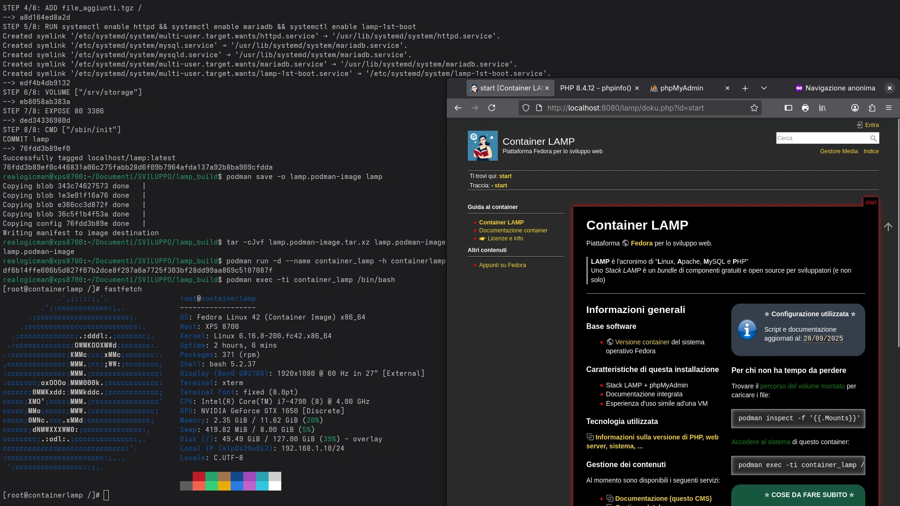

# LAMP

## Podman container: Fedora LAMP + phpMyAdmin + DokuWiki_ITA

Container initially made for personal use, mainly intended for Italian users. NO WARRANTY.

Documentation included under license "CC BY-NC-SA 4.0 Deed".

"ReaLoGiCMaN" is an anagram of "Marco Angeli".

Last modified: 07/09/2025

----

Instructions for installing the LAMP container as a non-privileged user:

```bash
wget https://github.com/realogicman/lamp/archive/refs/heads/main.zip
unzip main.zip
cd lamp-main/ 
podman build -t lamp .
podman run -d --name container_lamp -p 8080:80 lamp
```

Service available on local port 8080

----

Instructions to install the LAMP container on your system, running it automatically on every boot:

```bash
sudo systemctl enable podman-restart.service
wget https://github.com/realogicman/lamp/archive/refs/heads/main.zip
unzip main.zip
cd lamp-main/ 
sudo podman build -t lamp .
sudo podman run -d --name container_lamp -p 80:80 --restart=always lamp
```

Service available on local port 80

----

Documentation included in the container.


